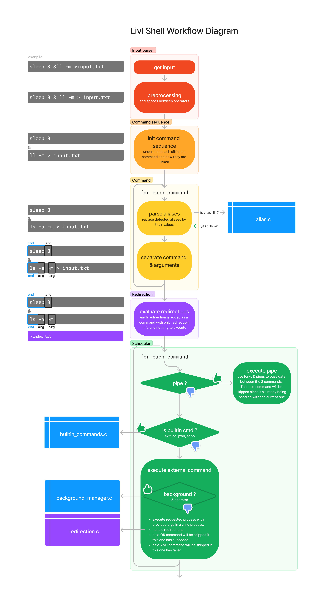

# Livl Shell Project Report

```
Julien VON DER MARCK
Franck GUTMANN
```

## Implementation

Instead of describing the implemented logic with long paragraphs, we've made a clear diagram of the logic being executed when the user enters a command.



For the sake of clarity, not everything is detailled in the diagram, and not everything is show on it. Only the logic of command handling is shown.

The main function has a simple role : decide if the shell was run in batch mode or interactive mode.

### Batch mode

In batch mode, it will check that the argument is valid before starting the command execution. If it is not, it will exit with an error code while printing usage information.


### Interactive mode

The interactive mode tell the user who and where he is, and wait for a command to be entered. When a command is entered, it checks that the input is valid then starts the command execution.

### History

Right after receiving the input, the shell will add it to the history. The command history is a simple text file (by default `history.txt`) where each input is written on a new line.

#### Navigating through the history

Livl Shell was also ready to let the user navigate through the history with the up and down arrows. However, we had to rollback this feature.

For being able to catch the press on arrow keys, we had to ditch the use of a simple `readline` or `fgets` and instead use the `termios` library to have a full control over what's happening in the terminal. It kind of worked well at first glance, but having manual control over the terminal meant that we had to handle every single case of user input, including the arrow keys, the backspace, the delete key, the home and end keys, etc.

It was a lot of work but we sorted out most of the cases. But when trying on other machines (macOS, WSL, ubuntu), we realized that every single platform has his own way of handling the terminal, and that we would have to handle every single case for every single platform. We finally gave up since it was simply not possible for us to make a reliable system without sacrificing our lives and our families...

Our work is still available on the `fg/feat/history` branch. Navigating through history works, but you can except some weird things happening to what you type in the terminal.

### Builtin commands

The implementation of builtin commands is pretty straightforward since the c standard library provides everything we need.

| Shell command | C function | Description |
|---------------|------------|-------------|
| `cd` | `chdir` | Change the current working directory |
| `exit` | `exit` | Exit the shell |
| `pwd` | `getcwd` | Print the current working directory |
| `echo` | `printf` | Print the arguments to the standard output |

### Redirections

Handling redirections was one of the most challenging part of the project.

#### Input redirection

When using `<<` input redirection, a temporary file is created in write mode, and the content of the file is written to it. 

Then, the temp file is read in case of `<<` operator or the specified file is read in case of `<` operator, and the file content is written to the standard input.

#### Output redirection

Output redirection is easier. We simply open the specified file in write mode, and write the standard output to it. 

The only difference between `>` and `>>` is the flags being used when opening the file. `O_APPEND` for `>>` and `O_TRUC` for `>`.

#### Pipe

Pipes are handled by creating a new process with `fork` and a pipe with `pipe`. The parent process will write to the pipe, and the child process will read from it.

### Background management

The background manager keeps track of all the background processes with a list of `BackgroundProcess` structures. Each structure contains the pid of the process, the command that was executed and a job number.

When a process is started in background, the manager will add it to the list. When a process is finished, the manager will remove it from the list and print the job number and the command that was executed.

### Aliases

The shell load the aliases at startup from a file (by default `aliases.txt`). The file contains one alias per line, with the format `alias_name=command`.

Alias is checked at the command level. For each command, it will only check for alias on the command name, not on the arguments.

For example, when the user enters `ll -am && echo ll`, only `ll` and `echo` will be checked for aliases. In this case, `ll` will be replaced by `ls -am` and the command will be executed as `ls -am && echo ll`.

## What we've learned

### The real role and power of the shell

This project was a great way to really understand what is the role of the shell we are using every day and how it works. At first glance, it seems like a simple program that takes commands and execute them. But when you start to dig into it, you realize that it's a lot more complicated than that.

### Handling strings in C

We've had a lot of works with handling strings in C. We mainly had to use `strtok` to split a string into tokens, `strdup` to duplicate a string, `strcat` to concatenate strings, etc...

### System calls

It was also a great way for us to train our skills with system calls. Some of them like `fork`, `pipe`, `dup2`, `execvp`, `waitpid` were very important.

### Project architecture conception

We are pretty happy with what we've ended up with. However, we realized at the end that we could have done a better job for a better architecture that would have been easier to work with and to maintain. We should maybe have made a workflow diagram early in the project rather than at the end.
